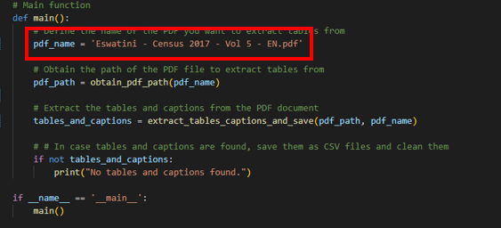
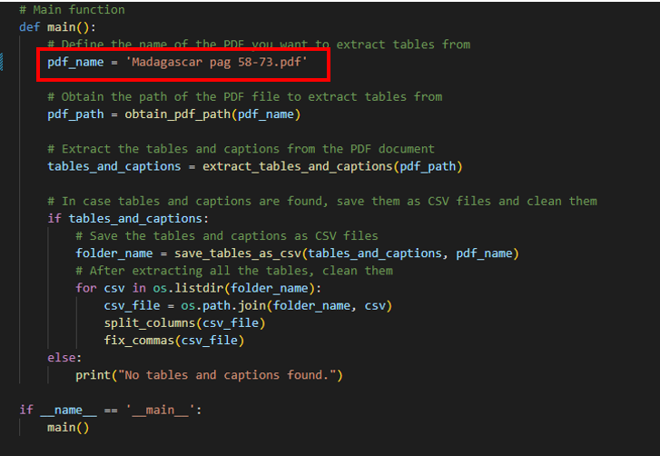

# Map-Action PDF table extraction tool
This repository contains the code for the Map-Action PDF table extraction tool.

## Introduction
This project aims to create a data extraction tool. It can take one or several pdf files as input. Additionally, it requires parameters such as country name, administrative divisions, list of indicators, and keywords. The output is one or several csv's . They contain relevant indicators per administrative division. Furthermore, it includes metadata such as page number and format. The tool should support English, French, and Spanish.

The code has been developed by a cooperation of ABW & Pipple.

## How to install the project
Clone the project.

The Python version used is 3.12.1

The requirements.txt file provides all the necessary python packages for this project. They can be installed using a virtual environment and following these steps:

* Open command prompt (cmd) or a terminal in your IDE of choice and provide the following commands:
     - `pip install virtualenv`
    - cd folder/path/you/want/venv/in 
    - `python -m venv myenv`
    - Change directory to: 
        - (Windows:) cd myenv/Scripts 
        - (Linux:) cd myenv/lib
    - Activate your newly created myenv by:
        - (Windows:) `activate.bat` 
        - (Linux:) `activate`
    - cd folder/path/to/requirements/file

To perform the following step, it's essential that you already cloned the repo.

    - `pip install -r requirements.txt`

The installation might take a while.

## How to run the project
Make sure to put the PDF you want tables to be extracted from in the 'input_pdf' folder of the repository.

Then there are 2 scripts you can run. In the two test cases available, the first method (extract_tables_using_gmft.py), performs best. However since this does depend on the PDF as input, it might be useful to try also the second method (extract_tables_using_tabula-py.py). 

### Method 1: extract_tables_using_gmft.py
This file uses [gmft](https://github.com/conjuncts/gmft) as the extraction method. 

In the main function, the variable 'pdf_name' should be altered to the name of the pdf you want to be used for the extraction. Thus search for 'pdf_name' and alter the name of the PDF (where it shows now: 'Eswatini - Census 2017 - Vol 5 -EN.pdf'). The image below shows what you'll find when searching for pdf_name. Important: don't forget to add '.pdf' add the end of the name of the file, otherwise it won't recognise it.

After altering the name, you can run the python file with the correct environment installed.

This will create a new folder in the folder output_csv, this folder will be named as the name of your pdf, followed by the current date and time of extraction. In this folder you'll see the extracted csv's which are named as the name of the table and at the end of it the word PAGE_NUMBER, followed by the page number of the document provided. This gives you the opportunity to check the pdf and its page to see whether the table is corrected properly. 

### Method 2: extract_tables_using_tabula-py.py
This file uses [tabula-py](https://pypi.org/project/tabula-py/#description) as the extraction method. 

In the main function, the variable 'pdf_name' should be altered to the name of the pdf you want to be used for the extraction. Thus search for 'pdf_name' and alter the name of the PDF (where it shows now: 'Madagascar pag 58-73.pdf'). The image below shows what you'll find when searching for pdf_name. Important: don't forget to add '.pdf' add the end of the name of the file, otherwise it won't recognise it.

After altering the name, you can run the python file with the correct environment installed.

This will create a new folder in the folder output_csv, this folder will be named as the name of your pdf, followed by the current date and time of extraction. In this folder you'll see the extracted csv's which are named as the name of the table and at the end of it the word PAGE_NUMBER, followed by the page number of the document provided. This gives you the opportunity to check the pdf and its page to see whether the table is corrected properly. 

When using this method, you might find that some of the pdf's are named 'CHANGED_name_of_pdf'. These are the csv's that, after being extracted, are ran through the cleaning functions, to obtain a better format of the tables. In the same folder you'll also find the original extracted csv (thus with the same name but without CHANGED_ in front of it), which you could also check to see if it has indeed improved.